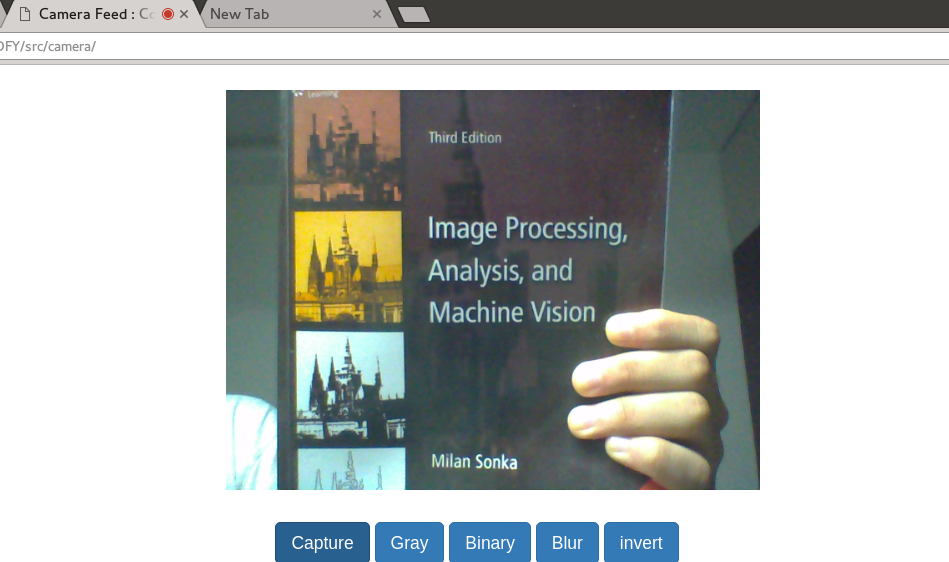

#  TrackingJS samples

This repository is intended to provide example code for how to integrate 
and use [Tracking.JS](https://github.com/eduardolundgren/tracking.js)
 along with basic HTML5 canvas elements.

### Contents : 

- dependencies : contains bootstrap
- TRACKING : clone of [Tracking.JS](https://github.com/eduardolundgren/tracking.js)
- src : source files

### Topics covered : 

- Simple HTML5 - JS webcam interfacing
- Basic Image Processing effects : Gray, binary, inversion
- Color Tracking using Tracking.JS
- Face Tagging and Tracking
- Video Feature based matching

### Experiment images !!

This repository is open for contribution.
